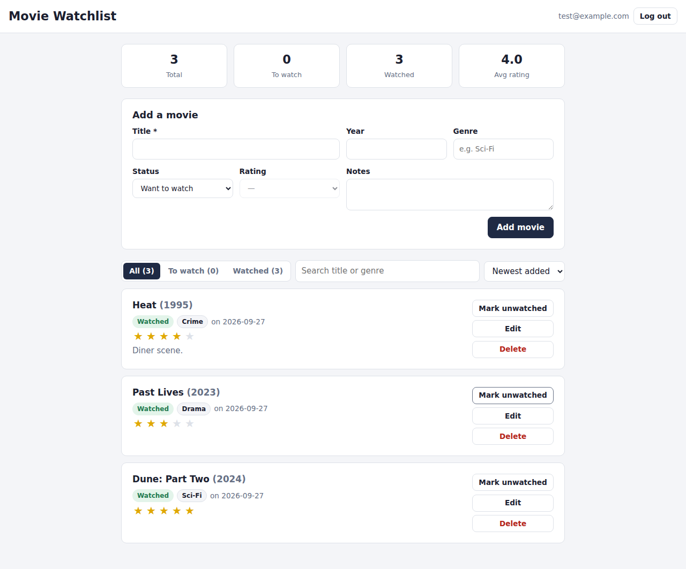

# Movie Watchlist

A web app for keeping track of movies you want to watch and the ones you've already seen. Each user registers an account, and their watchlist is stored in a Supabase (PostgreSQL) database that only they can read or change.

**Live app:** https://movie-watchlisted.netlify.app
**Demo video (YouTube, unlisted):** https://youtu.be/YOUR-VIDEO-ID



## What it does

- **Accounts:** register, log in, and log out with email and password (Supabase Auth). You must be logged in to view or change any data.
- **Create:** add a movie with title, release year, genre, status (Want to watch / Watched), a 1–5 star rating, and notes.
- **Read:** see your whole list, with totals for all, to-watch, and watched movies and your average rating.
- **Update:** mark a movie watched or unwatched (the watched date is recorded), click stars to rate it, or edit any field.
- **Delete:** remove a movie from your list.
- **Browse:** filter by status, search by title or genre, and sort by date added, title, year, or rating.
- Works on phones and desktops, with light and dark themes that follow the system setting.

## Technologies used

| Layer | Technology |
|---|---|
| Frontend | React 19, Vite 8, plain CSS |
| Backend / database | Supabase: PostgreSQL + Supabase Auth, accessed with `@supabase/supabase-js` |
| Security | PostgreSQL Row Level Security, so each user can only access their own rows |
| Hosting | Netlify |
| CI | GitHub Actions (builds the app on every push and pull request) |
| AI tooling | Built with an AI coding assistant (Claude) for code generation, debugging, and documentation |

## Project structure

```
movie-watchlist/
├── index.html                 # HTML entry point
├── netlify.toml               # Netlify build settings + SPA redirect
├── .env.example               # Required environment variables
├── supabase/
│   └── schema.sql             # movies table, updated_at trigger, RLS policies
├── src/
│   ├── main.jsx               # React entry point
│   ├── App.jsx                # Session handling: shows Auth or Watchlist
│   ├── index.css              # Styles (light/dark, responsive)
│   ├── lib/
│   │   ├── supabaseClient.js  # Creates the Supabase client from env vars
│   │   ├── movies.js          # Data access: list/create/update/delete
│   │   └── date.js            # Local-date helper
│   └── components/
│       ├── Auth.jsx           # Register / log in form
│       ├── Watchlist.jsx      # Stats, add form, filters, list
│       ├── MovieForm.jsx      # Shared add/edit form
│       └── MovieCard.jsx      # One movie: rating, status toggle, edit, delete
└── .github/workflows/build.yml
```

### How the frontend talks to the backend

1. `App.jsx` asks Supabase Auth for the current session and listens for login/logout events.
2. After login, `Watchlist.jsx` calls the functions in `lib/movies.js`, which use `supabase.from('movies')` to send requests to Supabase's REST API. The user's access token goes with each request.
3. In the database, Row Level Security policies (`auth.uid() = user_id`) filter every select, insert, update, and delete, so one user can never see or edit another user's movies. That is why the public "anon" key can safely live in the frontend.

### Database table: `movies`

| Column | Type | Notes |
|---|---|---|
| `id` | uuid | Primary key |
| `user_id` | uuid | Owner; defaults to `auth.uid()` |
| `title` | text | Required, 1–200 chars |
| `year` | int | 1888–2100 |
| `genre` | text | Optional |
| `status` | text | `want` or `watched` |
| `rating` | int | 1–5, optional |
| `notes` | text | Optional, up to 1000 chars |
| `watched_on` | date | Set when marked watched |
| `created_at` / `updated_at` | timestamptz | `updated_at` is maintained by a trigger |

## Setup instructions

### Prerequisites
- Node.js 20.19+ or 22.12+
- A free [Supabase](https://supabase.com) account

### 1. Clone and install
```bash
git clone https://github.com/Papi-Hokage/movie-watchlist.git
cd movie-watchlist
npm install
```

### 2. Create the database
1. Create a new project in Supabase.
2. Open **SQL Editor → New query**, paste the contents of `supabase/schema.sql`, and click **Run**.
3. (Optional, easier for testing) Go to **Authentication → Sign In / Providers → Email** and turn off **Confirm email**, so new accounts can log in right away. If you leave it on, users must click the link in the confirmation email first.

### 3. Add environment variables
Copy `.env.example` to `.env` and fill in the values from **Project Settings → API** (the Project URL and the `anon` `public` key):
```
VITE_SUPABASE_URL=https://xxxx.supabase.co
VITE_SUPABASE_ANON_KEY=eyJ...
```

### 4. Run locally
```bash
npm run dev
```
Open http://localhost:5173.

### 5. Deploy to Netlify
1. On Netlify, choose **Add new site → Import an existing project** and pick this GitHub repository. `netlify.toml` already sets the build command (`npm run build`) and publish directory (`dist`).
2. Under **Site configuration → Environment variables**, add `VITE_SUPABASE_URL` and `VITE_SUPABASE_ANON_KEY`.
3. Deploy.
4. In Supabase, go to **Authentication → URL Configuration** and set **Site URL** to your Netlify URL, so confirmation emails link to the live site.
